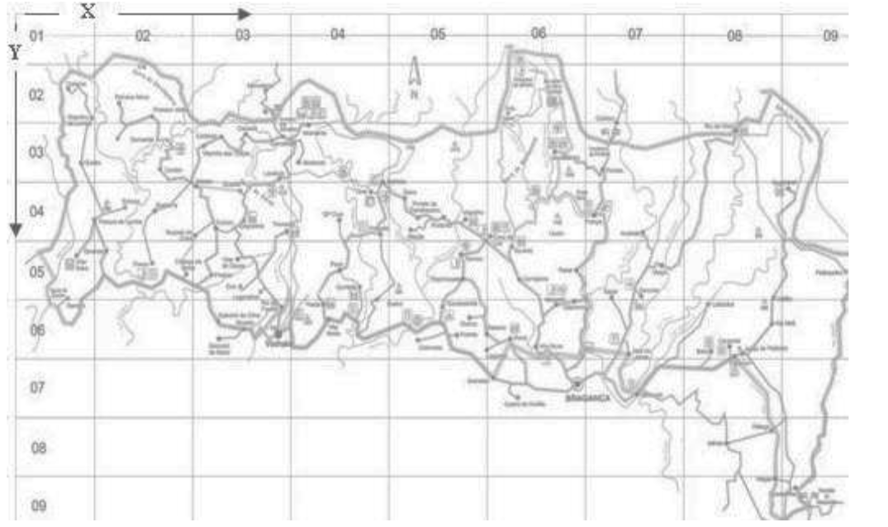

```{r setup, include=FALSE}
knitr::opts_chunk$set(echo = TRUE)
library(ggplot2)
library(dplyr)
```

```{r echo=FALSE}
fires <- read.csv(file='forestfires.csv')
```

## Univariate analysis

### FFMC
The Fine Fuel Moisture Code (FFMC) is a numeric rating of the moisture content of litter and other cured fine fuels. This code is an indicator of the relative ease of ignition and the flammability of fine fuel.

#### Raw data
```{r echo=FALSE}
fluidRow(
  column(6, renderPlot(ggplot(fires, aes(FFMC)) + geom_density(alpha=0.5, fill="green"))),
  column(6, renderPlot(boxplot(fires$FFMC, col="lightblue")))
)
```

#### After removing outliers
```{r echo=FALSE}
out <- boxplot(fires$FFMC, plot=FALSE)$out
fires_without <- fires[-which(fires$FFMC %in% out),]

fluidRow(
  column(6, renderPlot(ggplot(fires_without, aes(FFMC)) + geom_density(alpha=0.5, fill="green"))),
  column(6, renderPlot(boxplot(fires_without$FFMC, col="lightblue")))
)
```


### DMC
The Duff Moisture Code (DMC) is a numeric rating of the average moisture content of loosely compacted organic layers of moderate depth. This code gives an indication of fuel consumption in moderate duff layers and medium-size woody material. 

```{r echo=FALSE}
fluidRow(
  column(6, renderPlot(ggplot(fires, aes(DMC)) + geom_density(alpha=0.5, fill="green"))),
  column(6, renderPlot(boxplot(fires$DMC, col="lightblue")))
)
```

### DC
The Drought Code (DC) is a numeric rating of the average moisture content of deep, compact organic layers. This code is a useful indicator of seasonal drought effects on forest fuels and the amount of smoldering in deep duff layers and large logs.

```{r echo=FALSE}
fluidRow(
  column(6, renderPlot(ggplot(fires, aes(DC)) + geom_density(alpha=0.5, fill="green"))),
  column(6, renderPlot(boxplot(fires$DC, col="lightblue")))
)
```

### ISI
The Initial Spread Index (ISI) is a numeric rating of the expected rate of fire spread. It combines the effects of wind and the FFMC on rate of spread without the influence of variable quantities of fuel.
```{r echo=FALSE}
fluidRow(
  column(6, renderPlot(ggplot(fires, aes(ISI)) + geom_density(alpha=0.5, fill="green"))),
  column(6, renderPlot(boxplot(fires$ISI, col="lightblue")))
)
```

### RH
Relative humidity in %
```{r echo=FALSE}
fluidRow(
  column(6, renderPlot(ggplot(fires, aes(RH)) + geom_density(alpha=0.5, fill="green"))),
  column(6, renderPlot(boxplot(fires$RH, col="lightblue")))
)
```

### temp
Temperature in Celsius degrees
```{r echo=FALSE}
fluidRow(
  column(6, renderPlot(ggplot(fires, aes(temp)) + geom_density(alpha=0.5, fill="green"))),
  column(6, renderPlot(boxplot(fires$temp, col="lightblue")))
)
```

Distribution of temperature is very close to normal distribution with a mean of 20

```{r echo=FALSE}
ggplot(fires) + geom_bar(aes(x= reorder(month, temp), temp, fill = month), position = "dodge", stat = "summary", fun.y = "mean")
```

As expected, summer months are the warmest and winter the coldest.

### wind
Wind speed in km/h
```{r echo=FALSE}
fluidRow(
  column(6, renderPlot(ggplot(fires, aes(wind)) + geom_density(alpha=0.5, fill="green"))),
  column(6, renderPlot(boxplot(fires$wind, col="lightblue")))
)
```

### rain
Outside rain in mm/m2
```{r echo=FALSE}
fluidRow(
  column(6, renderPlot(ggplot(fires, aes(rain)) + geom_density(alpha=0.5, fill="green"))),
  column(6, renderPlot(boxplot(fires$rain, col="lightblue")))
)
```

Measures different than 0
```{r echo=FALSE}
fires_with_rain <- fires[-which(fires$rain == 0),]
fires_with_rain
```

```{r echo=FALSE}
inputPanel( selectInput("rain_summary_method", "Choose a aggegation methon:", list('method'=c("mean", "sum"))))

renderPlot({
  ggplot(fires) + geom_bar(aes(x= reorder(month, rain), rain, fill = month), position = "dodge", stat = "summary", fun.y = input$rain_summary_method)
})
```
The graph shows that it rained only three months a year in the park. Most of the rain fell in August.

### Burned area summary
```{r echo=FALSE, warning=FALSE}
fluidRow(
  column(6, renderPlot(ggplot(fires, aes(area)) + geom_density(alpha=0.5, fill="green"))),
  column(6, renderPlot(boxplot(fires$area, col="lightblue")))
)
areas <- fires %>% select(X, Y, area) %>% group_by(X, Y) %>% summarize(sum_area = sum(area))
ggplot(areas, aes(X, -Y)) + geom_raster(aes(fill = sum_area)) + scale_x_continuous(breaks=seq(0,10,1)) + scale_y_continuous(breaks=seq(1,10,1))
```


### Fires each month
#### Number of fires each month
```{r echo=FALSE}
ggplot(fires, aes(x = reorder(month, fires$month==month, sum), y = (..count..)/sum(..count..), fill=month)) + geom_bar(stat = "count")  + labs(x='month', y='% of total number of fires')
```

As we can see almost 70% of all fires took place in September and August.

#### Mean area burned during fire each month:
```{r echo=FALSE}
ggplot(fires) + geom_bar(aes(x= reorder(month, area), area, fill = month), position = "dodge", stat = "summary", fun.y = "mean")

inputPanel( selectInput("area_summary_method", "Choose a aggegation methon:", list('method'=c("mean", "sum"))))
renderPlot({
  ggplot(fires) + geom_bar(aes(x= reorder(month, area), area, fill = month), position = "dodge", stat = "summary", fun.y = input$area_summary_method)
})
```

We see that on average the largest fires took place in May, but there were few of them and they were relatively large.

### Relationship between weather conditions and fire area size

```{r echo=FALSE}
ggplot(fires, aes(x=temp, y=area)) + 
  geom_smooth(method="lm") +
  coord_cartesian(ylim=c(0, 40)) +
  labs(title="Temperature & Area")
```

```{r echo=FALSE}
ggplot(fires, aes(x=RH, y=area)) + 
  geom_smooth(method="lm") +
  coord_cartesian(ylim=c(0, 40)) +
  labs(title="Humidity & Area")
```

```{r echo=FALSE}
ggplot(fires, aes(x=temp, y=RH)) + 
  geom_smooth(method="lm") +
  labs(title="Temperature & Humidity")
```

Looking at three charts above we can see that everything looks very reasonable. There is clear dependency between temperature and area. The higher temperature is, the bigger fires are. It cannot be denied that fire area also decreases when humidity becomes higher. Third chart only confirms our data correctness. When temperature rises, humidity decreases - so fires area rises.


```{r echo=FALSE}
ggplot(fires, aes(x=wind, y=area)) + 
  geom_point() + 
  geom_smooth(method="lm") +
  labs(title="Wind & Area")
```

There is no doubt that above chart in real world would be really surprising. It looks like there is very little dependency between wind and fire area in this forest. Considering our data about wind and wind chart we saw before it must be admitted that wind doesn't really change in this forest, so it's impact is minimal.


